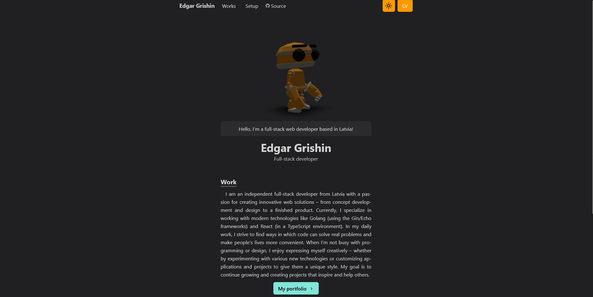

#  Portfolio Website

A modern, performant personal portfolio website showcasing my work as a full-stack web developer. Built with React, TypeScript, and featuring an interactive 3D experience.



##  Features

###  Design & UX
- **Interactive 3D Model**: Three.js-powered robot character that users can rotate and interact with
- **Dark/Light Theme**: Automatic theme detection based on system preferences with manual toggle
- **Theme Persistence**: User preferences saved across sessions
- **Responsive Design**: Fully responsive across all devices (mobile, tablet, desktop)
- **Smooth Animations**: CSS animations using animate.css library

###  Internationalization
- **Bilingual Support**: Full English and Latvian translations
- **Easy Language Toggle**: Switch languages with a single click
- **Localized Content**: All content, including project descriptions, available in both languages

###  Performance
- **Code Splitting**: Route-based lazy loading for optimal bundle size
- **Image Optimization**: Lazy loading images with responsive sizing
- **Memoization**: React.memo and hooks optimization for minimal re-renders
- **Error Boundaries**: Graceful error handling with user-friendly fallbacks
- **Suspense Loading**: Smooth loading states during navigation

###  Sections
1. **Home**: Introduction, skills, and social links
2. **Works**: Portfolio of projects with detailed descriptions
3. **Setup**: Development environment configurations and dotfiles
4. **404 Page**: Custom not-found page with navigation options

## Tech Stack

### Frontend
- **React 18** - UI library
- **TypeScript** - Type safety and better DX
- **Vite** - Fast build tool and dev server
- **React Router** - Client-side routing
- **Tailwind CSS** - Utility-first CSS framework

### 3D & Animations
- **Three.js** - 3D graphics
- **@react-three/fiber** - React renderer for Three.js
- **@react-three/drei** - Useful helpers for Three.js
- **Animate.css** - CSS animations

### Internationalization
- **i18next** - Internationalization framework
- **react-i18next** - React integration for i18next

### UI Components
- **Embla Carousel** - Lightweight carousel for project images
- **React Icons** - Icon library (Font Awesome, Material Design)


##  Installation

### Prerequisites
- Node.js 24+ and npm/yarn/pnpm

### Setup

1. **Clone the repository**
```bash
git clone https://github.com/zshstacks/homepage.git
cd homepage
```

2. **Install dependencies**
```bash
npm install
# or
yarn install
# or
pnpm install
```

3. **Start development server**
```bash
npm run dev
# or
yarn dev
# or
pnpm dev
```

4. **Open in browser**
```
http://localhost:5173
```


## License

This project is [MIT](./LICENSE) licensed.

##  Author
- GitHub: [@zshstacks](https://github.com/zshstacks)


